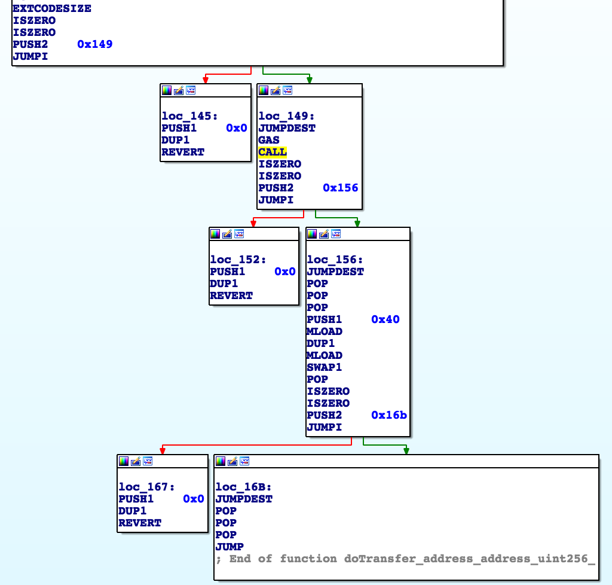
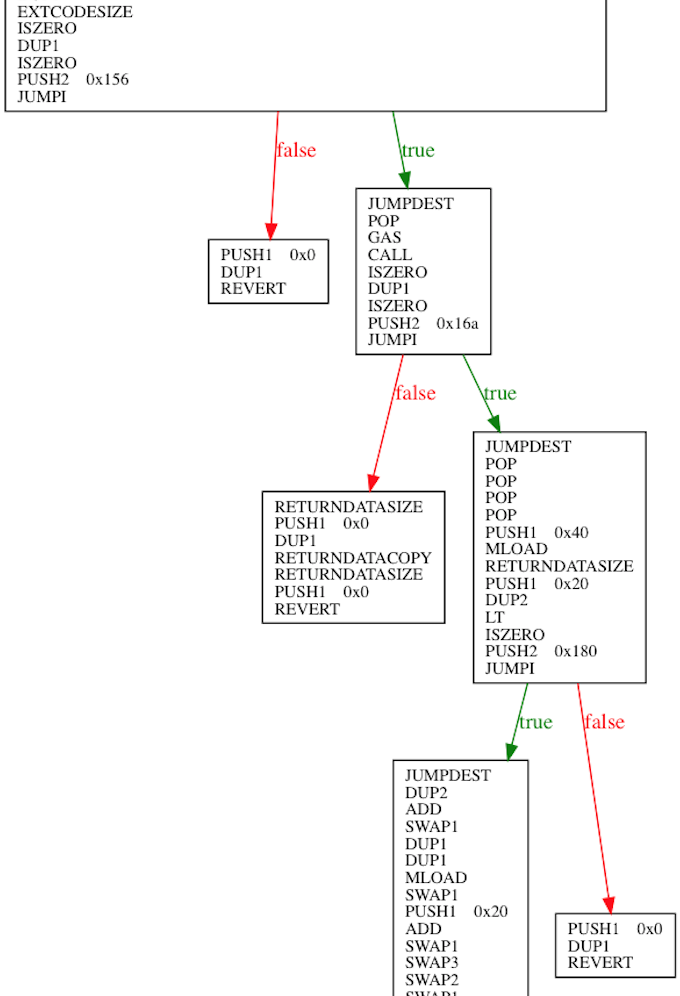

# badERC20Fix  [](https://www.gnu.org/licenses/gpl-3.0) [](https://gitter.im/sec-bit/Lobby) [](http://makeapullrequest.com)

大量 ERC20 Token 合约没有遵守 EIP20 [[1]](https://github.com/ethereum/EIPs/blob/master/EIPS/eip-20.md)，这些非标准合约将会对 DApp 的开发生态造成严重影响。

特别是自从今年4月17日，以太坊的智能合约语言编译器 Solidity 升级至 0.4.22 版本后，编译产生的合约代码将会无法兼容一些非标准的智能合约 [[2]](https://github.com/ethereum/solidity/issues/4116)，这会对 DApp 开发带来很大的困扰 [[3]](https://medium.com/coinmonks/missing-return-value-bug-at-least-130-tokens-affected-d67bf08521ca)。

其他细节参考 SECBIT（安比）实验室早前的详细报告 [[4]](https://mp.weixin.qq.com/s/1MB-t_yZYsJDTPRazD1zAA)[[5]](https://medium.com/loopring-protocol/an-incompatibility-in-smart-contract-threatening-dapp-ecosystem-72b8ca5db4da)，下面将着重介绍兼容方案的技术细节、使用场景和成本估算。

## 存在返回值兼容性问题的 Token

DApp 和 DEX 开发者如需获取不兼容 Token 列表，可关注 [awesome-buggy-erc20-tokens](https://github.com/sec-bit/awesome-buggy-erc20-tokens) 仓库。

- [transfer() 不兼容](https://github.com/sec-bit/awesome-buggy-erc20-tokens/blob/master/csv/transfer-no-return.o.csv)
- [transferFrom() 不兼容](https://github.com/sec-bit/awesome-buggy-erc20-tokens/blob/master/csv/transferFrom-no-return.o.csv)
- [approve() 不兼容](https://github.com/sec-bit/awesome-buggy-erc20-tokens/blob/master/csv/approve-no-return.o.csv)

## 符合标准的 ERC20 代码

```js
contract TokenStd {
    function transfer(address _to, uint256 _value) public returns (bool success) {
        return true;
    }
    function transferFrom(address _from, address _to, uint256 _value) public returns (bool success) {
        return true;
    } 
    function approve(address _spender, uint256 _value) public returns (bool success) {
        return true;
    }
}
```

## 不符合标准的 ERC20 代码

```js
// NEVER USE THIS
contract TokenNoStd {
    function transfer(address _to, uint256 _value) public {
    }
    function transferFrom(address _from, address _to, uint256 _value) public {
    }
    function approve(address _spender, uint256 _value) public {
    }
}
```

## 影响对象

使用 Solidity 0.4.22 及以上版本进行开发，并且需要调用其他 ERC20 Token `transfer()`、`transferFrom()`、`approve()` 方法的智能合约，均会受此兼容性问题影响。

主要包括以下两类开发者：

- 去中心化交易所（DEX）
- 使用 ERC20 Token 的 DApp

## 影响后果

- 一些非标准 Token 可能无法正常完成交易/转账
- 部分由合约管理的 Token 可能永远被锁定在合约中

可以预见，随着很多 DApp 的升级，会有越来越多的 ERC20 Token API 调用会失败（transfer()等函数会因为 EVM 执行 revert 而失败结束）。


## 细节剖析

此兼容性问题出现的原因一部分在于这些 ERC20 合约未按照标准编写，另一方面也在于新版 Solidity 编译器部分行为前后不一致。

请看以下示例代码：

```js
pragma solidity ^0.4.18;

interface Token {
    function transfer(address _to, uint256 _value) returns (bool success);
}

contract DApp {
  function doTransfer(address _token, address _to, uint256 _value) public {
    require(Token(_token).transfer(_to, _value));
  }
}
```

这段代码所做的就是调用目标 ERC20 合约的 transfer 函数，同样一段代码使用 Solidity 0.4.21 和 0.4.22 编译结果分别如下：

### 0.4.21



### 0.4.22



很明显，0.4.22 版本编译出的 bytecode，加入了对 RETURNDATASIZE 是否小于 32 的检查。如果目标合约是无 return 值的写法，则无法通过这个检查，从而导致 revert 发生。相对应的解决方案就是绕过编译器自动生成的 RETURNDATASIZE 判断，进行手动处理。

## 面向 DApp 和 DEX 的解决方案

```js
function isContract(address addr) internal {
    assembly {
        if iszero(extcodesize(addr)) { revert(0, 0) }
    }
}

function handleReturnData() internal returns (bool result) {
    assembly {
        switch returndatasize()
        case 0 { // not a std erc20
            result := 1
        }
        case 32 { // std erc20
            returndatacopy(0, 0, 32)
            result := mload(0)
        }
        default { // anything else, should revert for safety
            revert(0, 0)
        }
    }
}

function asmTransfer(address _erc20Addr, address _to, uint256 _value) internal returns (bool result) {
    // Must be a contract addr first!
    isContract(_erc20Addr);  
    // call return false when something wrong
    require(_erc20Addr.call(bytes4(keccak256("transfer(address,uint256)")), _to, _value));
    // handle returndata
    return handleReturnData();
}
```

使用 `call` 方法手动直接调用 `transfer()` 函数，并使用内联 assembly code 手动获取 `returndatasize()` 进行判断
 
- 如果为 0，则表明被调用 ERC20 合约正常执行完毕，但没有返回值，即转账成功
 
- 如果为 32，则表明 ERC20 合约符合标准，直接进行 `returndatacopy()` 操作，调用 `mload()` 拿到返回值进行判断即可
 
- 如果为其他值则 `revert`

其中 `returndatacopy()` 操作的细节为将 RETURNDATA 的 0 至 32 Byte 拷贝至 memory 的 0 至 32 Byte上，方便后面 `mload()` 读取拿到返回值。

```ruby
memory[destOffset:destOffset+length] = RETURNDATA[offset:offset+length]
```

完整的中间层代码也需要支持 `transferFrom()` 和 `approve()` 函数，完整代码请参考 [`badERC20Fix.sol`](badERC20Fix.sol)，欢迎 Fork 测试讨论。

此外，Lukas Cremer [[6]](https://gist.github.com/lukas-berlin/0f7005301f29e3881ad15449e68c2486#file-gistfile1-txt)和 BrendanChou [[7]](https://gist.github.com/BrendanChou/88a2eeb80947ff00bcf58ffdafeaeb61)的修复方案直接利用了非标准的`function transfer(address to, uint value) external`接口来进行函数调用。

我们认为应该尽量避免此种写法，社区理应推广符合 ERC20 标准的接口。

## 使用场景

使用 Solidity 0.4.22 及以上版本的 DApp 和 DEX 开发者，需要加载仓库中封装好的 ERC20AsmFn Library，并应用到标准 ERC20 上（`using ERC20AsmFn for ERC20`）。

在涉及调用 ERC20 Token 调用时，分别使用 `asmTransfer`、`asmTransferFrom`以及`asmApprove`替代`transfer`、`transferFrom`、`approve`。

注意，务必正确处理以上函数的返回值。

经测算，使用 `asmTransfer` 函数，每次 `transfer()` 会多出约 244 的 Gas 消耗。实际上我们还可以做一些优化，直接使用函数签名计算结果进行调用。

```js
require(_erc20Addr.call(bytes4(keccak256("transfer(address,uint256)")), _to, _value));
```

换为

```js
require(_erc20Addr.call(0xa9059cbb, _to, _value));
```

这样会将多出的 Gas 消耗由 **244** 降为 **96**。

SECBIT（安比）实验室会持续关注此 ERC20 安全和兼容性问题的最新进展，为广大开发者提供最安全最高效的解决方案。同时欢迎开发者积极讨论，为安全开源社区建设贡献宝贵力量。

## Reference

- [1] EIP20 规范文档, https://github.com/ethereum/EIPs/blob/master/EIPS/eip-20.md

- [2] Solidity 项目相关 Issue 讨论, https://github.com/ethereum/solidity/issues/4116

- [3] Lukas Cremer 的报道, https://medium.com/coinmonks/missing-return-value-bug-at-least-130-tokens-affected-d67bf08521ca

- [4] SECBIT（安比）实验室关于 Token 合约不兼容问题的报告, https://mp.weixin.qq.com/s/1MB-t_yZYsJDTPRazD1zAA

- [5] An Incompatibility in Ethereum Smart Contract Threatening dApp Ecosystem, https://medium.com/loopring-protocol/an-incompatibility-in-smart-contract-threatening-dapp-ecosystem-72b8ca5db4da

- [6] Lukas Cremer 的方案, https://gist.github.com/lukas-berlin/0f7005301f29e3881ad15449e68c2486#file-gistfile1-txt

- [7] BrendanChou 的方案, https://gist.github.com/BrendanChou/88a2eeb80947ff00bcf58ffdafeaeb61

## 版权声明

[GNU General Public License v3.0](https://www.gnu.org/licenses/gpl-3.0.en.html)
